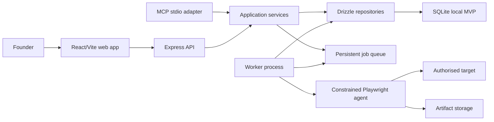

# PREMORTEM architecture

## Purpose

PREMORTEM is a launch-risk discovery system. It runs constrained browser sessions against an authorised website, stores observable evidence, derives deduplicated findings, and renders a report and replay. It does not predict conversion rates or claim that simulated customers reproduce human behaviour.

## Current MVP shape

The repository is a TypeScript workspace with four runnable applications and shared domain packages:

- `apps/web`: React 19 and Vite 8 user interface, backed by an Express 5 API.
- `apps/worker`: standalone process that claims jobs and runs Playwright sessions.
- `apps/demo-target`: controlled website containing seeded, observable defects.
- `apps/mcp`: local stdio MCP server that calls the same application services as the web API.
- `packages/core`: domain types, services, scoring, findings, jobs, and authorization rules.
- `packages/database`: Drizzle schema, migrations, repositories, and transaction helpers.
- `packages/browser-agent`: constrained browser actions, Playwright instrumentation, safety limits, and evidence capture.

SQLite with `better-sqlite3` is the local MVP database. The database package owns the persistence interface so a PostgreSQL driver can replace it without moving domain logic. Screenshots and traces use a filesystem storage adapter behind an artifact-storage interface.

## Request and job lifecycle

1. The API validates the rehearsal input and explicit authorization confirmation.
2. It canonicalizes and checks the target URL, creates an immutable rehearsal configuration, persists personas and scenarios, and enqueues session jobs.
3. The worker transactionally claims a queued job. A browser session receives the stored scenario, device profile, allowed domains, and hard limits.
4. A fresh browser context records steps, screenshots, console events, network failures, deterministic success signals, and termination reason.
5. Evaluation services generate deterministic findings first, deduplicate them by fingerprint, calculate confidence and launch readiness, and store report data.
6. The web app polls persisted state. Replays and reports read stored evidence; they do not reconstruct fictional events.
7. A rerun reuses the stored persona and scenario snapshots. Comparison services classify findings and outcomes as resolved, remaining, or new.

## Architectural rules

- UI, HTTP, worker, and MCP are adapters. Business decisions live in shared services.
- Browser work never runs in the web request lifecycle.
- Every externally supplied value is validated with Zod at its boundary.
- Rehearsal configuration, persona, and scenario snapshots are immutable inputs to a run.
- Jobs are idempotent, have explicit state transitions, and isolate failure per browser session.
- Objective evidence, observed simulated behaviour, and AI interpretation remain separate fields.
- LLM output cannot bypass deterministic success conditions, ownership, URL policy, or browser-action validation.
- Artifact references are stored in the database; storage implementation details are not.

## Deployment boundary

The local MVP intentionally favours one host and a shared SQLite file. A production deployment should use PostgreSQL, durable object storage, a dedicated worker runtime, authenticated users, rate limiting, and network-level egress controls. See [deployment.md](deployment.md) and [known-limitations.md](known-limitations.md).
