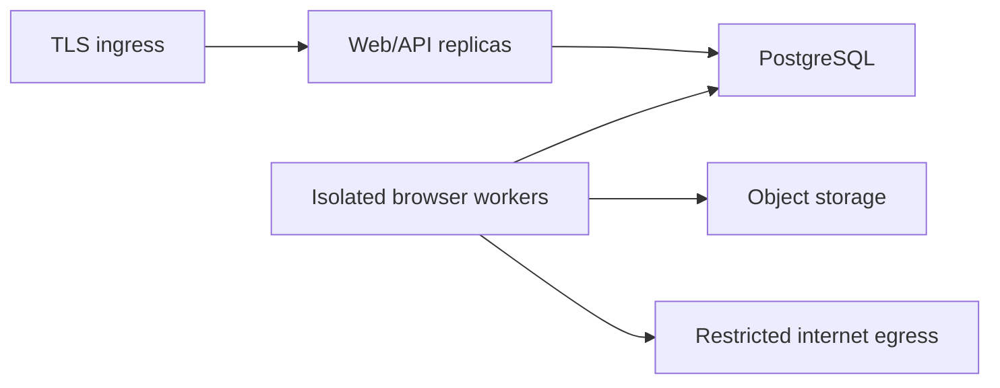

# Deployment guide

## Supported profiles

### Local MVP

A single trusted machine runs the Vite/Express web process, standalone worker, demo target, MCP process when needed, SQLite database, and filesystem artifact store. Localhost testing is enabled only for the explicitly configured demo origin.

Typical workspace commands are:

```bash
pnpm install
pnpm db:migrate
pnpm dev
pnpm test
pnpm typecheck
pnpm build
```

Use the root `README.md` and package scripts as the command authority if they differ. Playwright browser binaries must be installed for the worker and E2E environment.

For a one-command local installation, run `scripts/setup.ps1` on Windows or `./scripts/setup.sh` on macOS/Linux. The scripts install dependencies and Chromium, create a local ignored `.env`, migrate the database, and open the app. The first installation requires internet access; deterministic rehearsals can run without an AI key after the required packages and browser are installed.

Docker users can run `docker compose up --build` and open `http://127.0.0.1:4310`. The Compose profile binds only to loopback and persists state in the `premortem-data` volume. The bundled local profile is for one trusted computer; it must not be exposed as an unauthenticated public service.

### Production target

Deploy the web/API and browser worker as separate processes or containers. Use PostgreSQL and durable object storage. Do not deploy the SQLite file or local development identity across replicas.



## Required production controls

- Terminate TLS and set secure headers at the ingress or application.
- Use real authentication and server-derived ownership.
- Rate-limit rehearsal creation by user and source, and apply concurrency quotas.
- Run workers without cloud credentials, host mounts, or access to internal networks.
- Deny private, loopback, link-local, and metadata destinations at the network layer as well as in application code.
- Keep API and worker secrets separate; browser contexts receive neither.
- Use read/write database credentials with least privilege and run migrations as a separate deployment step.
- Store artifacts privately, issue short-lived authorized reads, and define retention/deletion policy.
- Set CPU, memory, process, browser, job, and outbound bandwidth limits.
- Centralize structured logs without tokens, keys, raw private form values, or screenshot bodies.
- Expose API and worker health separately; health does not include private data.

## Configuration classes

Configuration should cover application origin, database connection, artifact backend, worker concurrency, session budgets, permitted demo origin in development, AI provider credentials, log level, and report visibility. Environment parsing must fail closed in production if authentication, database, or network-policy settings are missing.

Development-only localhost permission must be tied to an explicit environment mode and exact demo origin. A generic `ALLOW_PRIVATE_NETWORKS=true` production switch is unsafe.

## Database and artifacts

Run generated Drizzle migrations before starting new application code. Back up PostgreSQL and test restore procedures. Artifact rows contain storage keys, not public URLs; deploy object lifecycle rules only after they match report-retention requirements.

## Release verification

Before promotion, run formatting, linting, type checking, unit and integration tests, Playwright browser-agent tests, E2E tests against the demo target, MCP contract tests, dependency audit, and a production build. From inside the worker environment, verify that public test targets are reachable and private/metadata targets are not.

## Rollback

Application rollback must preserve compatible database migrations. Prefer expand-and-contract schema changes. Pause new job claiming before worker rollback, allow or cancel active sessions deliberately, and retain audit events explaining interrupted runs.
